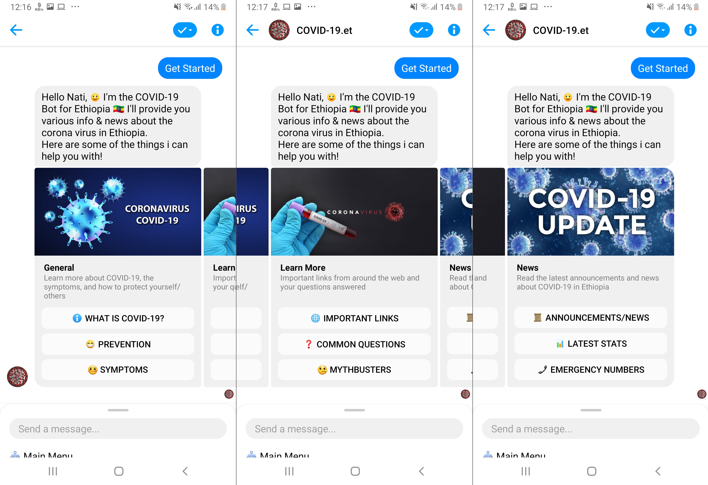
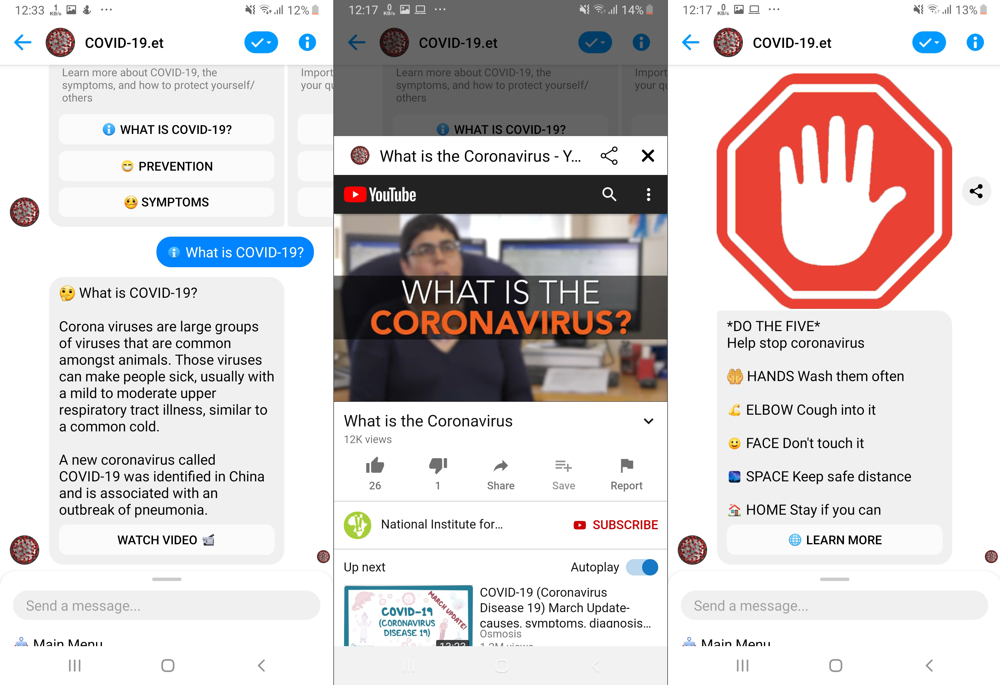
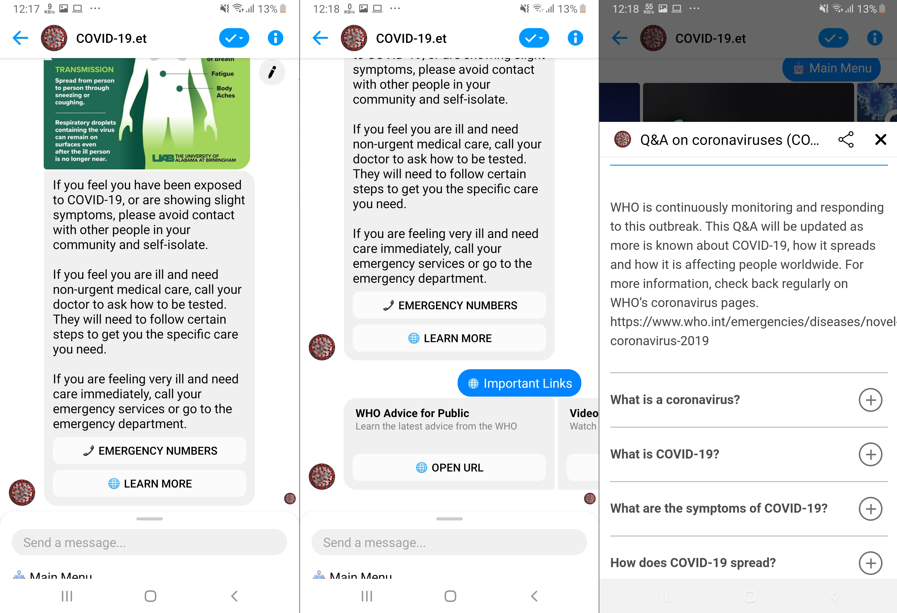
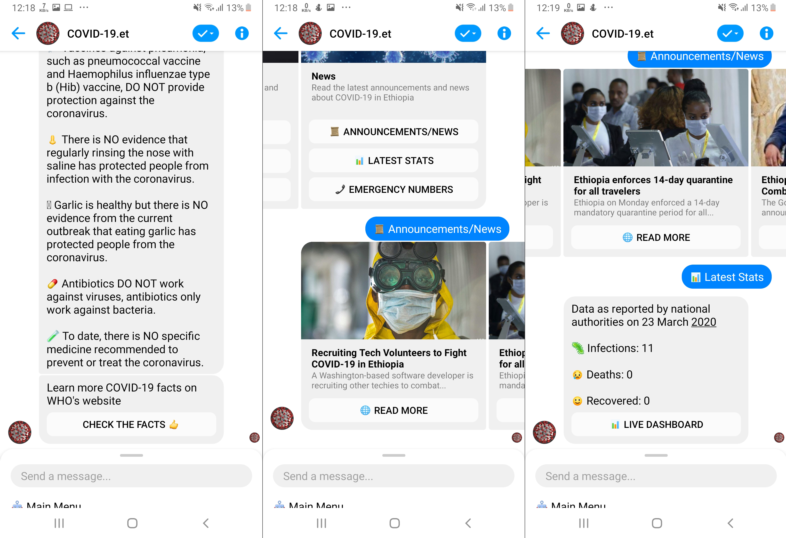
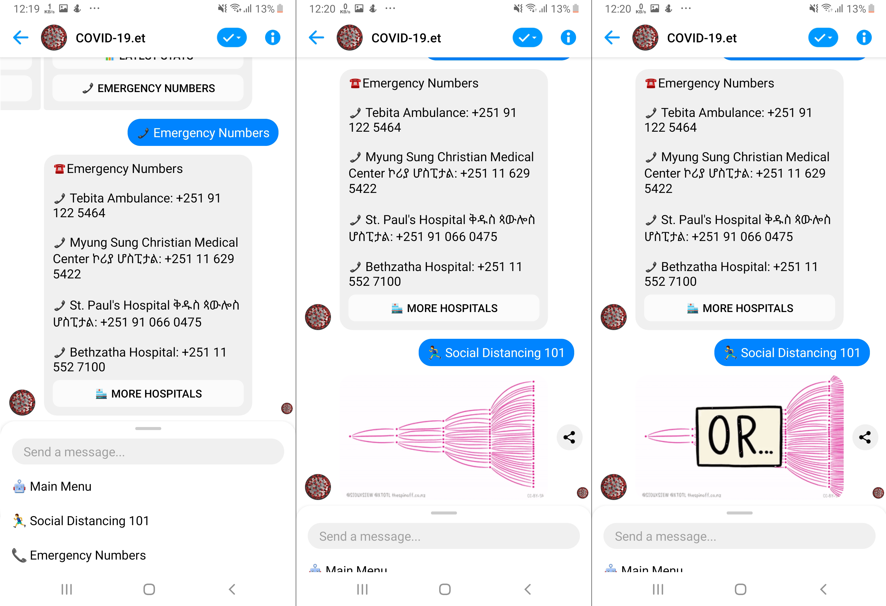

# Messenger Bot for COVID-19 awareness in Ethiopia

You can try the bot [here](https://m.me/110532390586248)

## Progress
- [x] Provide general information about COVID-19, prevention, and symptoms
- [x] Provide important links, answer frequently asked questions, and dispel common myths
- [x] Provide news, stats & emergency numbers
- [x] Fetch latest infection stats from the official PM Office api https://api.pmo.gov.et/v1/cases
- [ ] Support multiple languages
- [ ] Use dialogflow to do NLP (smalltalk with the user and accept commands, questions)
- [ ] Fetch relevant COVID-19 news from an existing api or build one

## Building and Deploying
Run `$ yarn` to install the dependencies and set these environment variables:

- **PAGE_ACCESS_TOKEN**
- **VERIFY_TOKEN**
- **APP_SECRET**
- **PORT**

Check the [Messenger Platform Quick Start](https://developers.facebook.com/docs/messenger-platform/guides/quick-start) for how to get the first three and to setup your webhook.

For your webhook URL you can deploy the app to heroku or if you want to run the server locally you can use [ngork](https://ngrok.com).

#### Contributing a fix or feature

1. Submit an issue describing your proposed fix or feature.
2. If your proposed fix or feature is accepted then, fork, implement your code change.
3. Ensure your code change follows the [accepted code style and structure](#code-style-and-structure).
4. Ensure your code is properly tested.
5. Ensure your commits follow the accepted [commit message style](#git-commit-messages)
6. Submit a pull request.

#### Code style and structure
The coding style must conform with the [Airbnb JavaScript Style Guide](https://github.com/airbnb/javascript). Run `$yarn --dev` to install the linter.

#### Git commit messages
This hasn't been the case so far but try to use [Udacity's Git commit message style guide](https://udacity.github.io/git-styleguide/).

## Screenshots
#### The main menu

#### What is COVID-19, Prevention

#### Symptoms, Important Links, Common Questions

#### Mythbusters, Latest announcements & news, Latest stats

#### Emergency Numbers, Social Distancing 101

## License

MIT License

Copyright (c) 2020 Nati Gossaye

Permission is hereby granted, free of charge, to any person obtaining a copy
of this software and associated documentation files (the "Software"), to deal
in the Software without restriction, including without limitation the rights
to use, copy, modify, merge, publish, distribute, sublicense, and/or sell
copies of the Software, and to permit persons to whom the Software is
furnished to do so, subject to the following conditions:

The above copyright notice and this permission notice shall be included in all
copies or substantial portions of the Software.

THE SOFTWARE IS PROVIDED "AS IS", WITHOUT WARRANTY OF ANY KIND, EXPRESS OR
IMPLIED, INCLUDING BUT NOT LIMITED TO THE WARRANTIES OF MERCHANTABILITY,
FITNESS FOR A PARTICULAR PURPOSE AND NONINFRINGEMENT. IN NO EVENT SHALL THE
AUTHORS OR COPYRIGHT HOLDERS BE LIABLE FOR ANY CLAIM, DAMAGES OR OTHER
LIABILITY, WHETHER IN AN ACTION OF CONTRACT, TORT OR OTHERWISE, ARISING FROM,
OUT OF OR IN CONNECTION WITH THE SOFTWARE OR THE USE OR OTHER DEALINGS IN THE
SOFTWARE.

